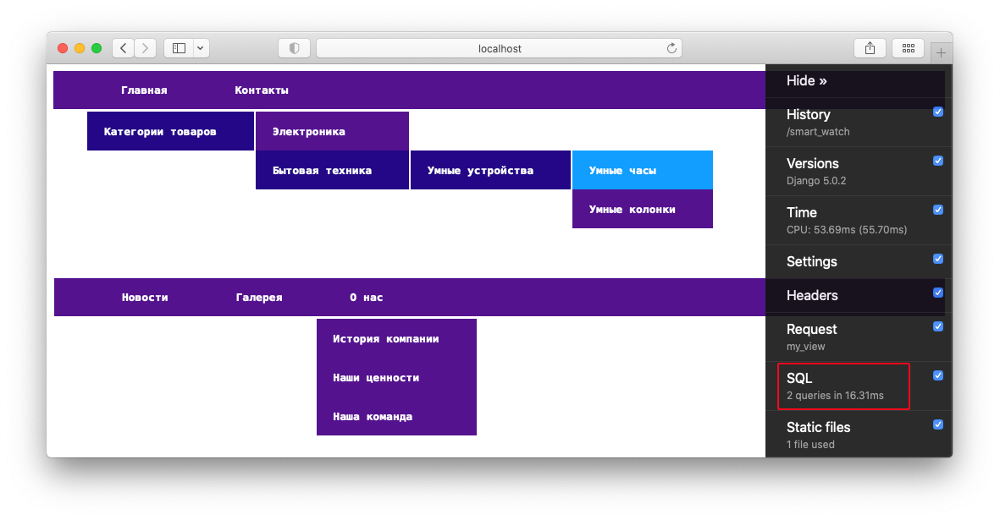

#### Тестовое задание:
Нужно сделать django app, который будет реализовывать древовидное меню, соблюдая следующие условия:  
1) Меню реализовано через template tag  
2) Все, что над выделенным пунктом - развернуто. Первый уровень вложенности под выделенным пунктом тоже развернут.  
3) Хранится в БД.  
4) Редактируется в стандартной админке Django  
5) Активный пункт меню определяется исходя из URL текущей страницы  
6) Меню на одной странице может быть несколько. Они определяются по названию.  
7) При клике на меню происходит переход по заданному в нем URL. URL может быть задан как явным образом, так и через named url.  
8) На отрисовку каждого меню требуется ровно 1 запрос к БД
 Нужен django-app, который позволяет вносить в БД меню (одно или несколько) через админку, и нарисовать на любой нужной странице меню по названию.  
 ``  
 При выполнении задания из библиотек следует использовать только Django и стандартную библиотеку Python.  

#### Реализация
К проекту прилагается база данных, в которую внесены пункты меню для проверки коррктности реализации.  
Меню поддерживает не ограниченную вложенность.  
Основная страница проекта http://localhost:8000/home, на которой отрисованы 2 меню.  
Второстепенная страница http://localhost:8000/second_page на которой отрисовано 1 меню.  
Согласно ТЗ выполняется 1 sql запрос к базе на одно меню.  
Для проверки в проект интегрирован debug-toolbar.    

#### Инструкция по локальному запуску:

##### Проверить что у вас установлен Python

Для пользователей Windows:
Откройте командную строку, нажав клавиши `Windows + R`, затем введите cmd и нажмите Enter.  
В командной строке введите `python --version` и нажмите Enter. Система должна показать версию Python, установленную на вашем компьютере.

Для пользователей MacOS и Linux:  
Откройте Терминал.  
В терминале введите `python3 --version` и нажмите Enter. Система должна показать версию Python, установленную на вашем компьютере.

##### Склонировать репозиторий и перейти в папку проекта

##### Установка виртуального окружения

Команда для установки виртуального окружения на Mac или Linux:  
`python3 -m venv venv`

Команда для Windows должна быть такая:  
`python -m venv venv`

##### Активация виртуального окружения

В Windows:  
выполнить инструкции из файла activate во вложенной папке venv/Scripts командой  
`source venv/Scripts/activate`

В macOS или Linux:  
выполнить инструкции из файла activate во вложенной папке venv/bin командой  
`source venv/bin/activate`

##### Установка зависимостей проекта

`pip install -r requirements.txt`

Cоздать `.env` файл в переменных среды окружения
Пример (указать свой ключ):  
`SECRET_KEY=django-insecure-v^=6edp7@7zg1r)a@p9^wno-#c^i1_vgf9(8j*2mve*_g5vv35`

##### Запуск миграции

`python manage.py migrate`

##### Создание пользователя

`python3 manage.py createsuperuser`  
Необходимо указать данные для доступа в административный интерфейс Django

##### Запуск сервера

`python manage.py runserver`
